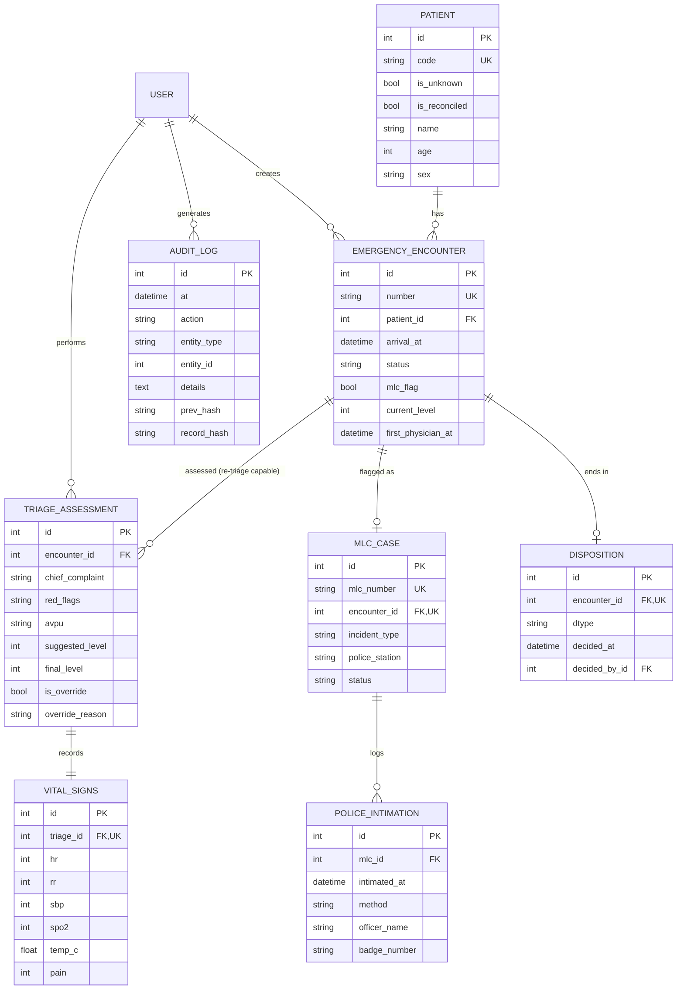

# P5 — Emergency Triage: M1 Requirements Sign-off

**Project**: P5 — Emergency Department Triage & Medico-Legal Workflow (PRD-05)
**Milestone**: M1 — Requirements sign-off
**Date**: Saturday, 11 July 2026
**Sprint scope rule**: Phase-1 features only, S-tier (●) level
**Status**: Submitted for gate review

---

## 1. Scoped Requirement List

Per the milestone schedule, P5 scope is **FR-1, FR-2, FR-4, FR-8** — which is exactly PRD-05 §12 Phase 1 ("triage, quick-reg, MLC core, dispositions"). All four are marked ● (full) at S-tier in PRD-05 §6, so none are degraded for this build.

| FR | Requirement (as scoped for build) | S-tier | Phase |
|---|---|---|---|
| **FR-1** | **Structured triage.** Configurable 5-level scale; vitals capture; auto-suggested level from chief complaint + vitals + red flags; nurse override with mandatory reason. | ● | 1 |
| **FR-2** | **Quick registration.** Treat-first, reconcile-later. Temp ID for unknown/unconscious patients; zero mandatory fields; nothing blocks care. Consumes PRD-01 FR-14 (stubbed — see §6). | ● | 1 |
| **FR-4** | **MLC module.** Auto-serialised MLC register; police intimation log (time, constable name/badge, mode of intimation); MLC flag propagates to every document for that encounter. | ● | 1 |
| **FR-8** | **Disposition workflows.** Admit (bed request — stubbed), refer-out (structured note), discharge with instructions, LAMA/DOR with counselling record, brought-dead/death-in-ED. | ● | 1 |

### Explicitly out of scope for this sprint
Deferred to PRD-05 Phases 2–3, **not built**: FR-3 tracking board (wireframe only, per M2 deliverable), FR-5 injury body-map, FR-6 chain-of-custody, FR-7 mandatory-reporting engine, FR-9 pre-arrival, FR-10 MCI mode, FR-11 pathway timers, FR-12 re-triage, FR-13 analytics, FR-14 free-treatment tracking. All AI-1…AI-5 GenAI features are optional stretch only.

### Decision D-1: Triage scale standardised on **AIIMS Triage Protocol (5-level)**

PRD-05 §14 leaves this open (AIIMS TP vs adapted ESI). **We choose AIIMS TP.** Rationale: PRD-05 recommends it for public-sector alignment; it is India-native, avoids ESI licensing questions, and its red-flag criteria are published. Implemented as a config table, not hardcoded — so an ESI swap is a data change, satisfying FR-1's "configurable scale".

| Level | Name | Colour | Target door-to-physician | Illustrative red flags |
|---|---|---|---|---|
| 1 | Resuscitation | Red | **Immediate** | Cardiac/resp arrest, GCS ≤ 8, SpO₂ < 90% on O₂, unrecordable BP, active severe haemorrhage |
| 2 | Emergent | Orange | **< 10 min** | Chest pain w/ ischaemic features, stroke (FAST+), SBP < 90, RR > 30, GCS 9–12, major trauma |
| 3 | Urgent | Yellow | < 30 min | Moderate trauma, persistent vomiting, fever w/ comorbidity, moderate pain (NRS 7–10) |
| 4 | Semi-urgent | Green | < 60 min | Minor fractures, simple lacerations, mild pain, stable vitals |
| 5 | Non-urgent | Blue | < 120 min | Dressing change, prescription refill, medical certificate |

Level-1 and Level-2 targets are lifted verbatim from PRD-05 §2 Goals. Levels 3–5 are our documented sprint assumption (**A-1**) — PRD-05 does not fix them.

---

## 2. User-Story Shortlist (≤ 6)

Selected from PRD-05 §5, filtered to the four in-scope FRs. Stories 2, 5, 6, 7 of the PRD map to out-of-scope FRs (tracking board, MCI, reporting engine, pre-arrival) and are dropped.

| ID | Story | FR | Acceptance criteria (demo-testable) |
|---|---|---|---|
| **US-1** | As a **triage nurse**, I want a ≤ 60-second structured triage (chief complaint, vitals, red flags → auto-suggested level) so acuity assignment is consistent across staff and shifts. | FR-1 | Form completes in ≤ 60 s with keyboard only; system suggests a level; suggestion is visibly derived from a rule, not a guess. |
| **US-2** | As a **triage nurse**, I want to **override** the suggested level, but be forced to say why. | FR-1 | Override cannot be saved with an empty reason; both suggested and final level are persisted, plus reason + who + when. |
| **US-3** | As a **triage nurse**, I want treat-first workflows for unknown/unconscious patients (temp ID, zero mandatory fields) because stabilisation precedes paperwork by law. | FR-2 | "Unknown patient" button issues a temp ID in ≤ 10 s with **no** mandatory field; patient is triageable immediately; identity reconcilable later without losing the audit trail. |
| **US-4** | As a **CMO**, I want a guided MLC workflow — auto-numbered MLC register + police intimation record — so 3 a.m. documentation is complete and defensible. | FR-4 | Flagging MLC allocates the next serial in `MLC/<YYYY>/<NNNN>` with no gaps; intimation log captures time, constable name/badge, mode; MLC badge appears on every screen and printout for that encounter. |
| **US-5** | As an **ED physician**, I want to record a disposition (admit / refer-out / discharge / LAMA / death) and have the encounter close cleanly. | FR-8 | All five paths reachable; each writes a timestamped disposition row; encounter state moves to CLOSED; LAMA requires a counselling record; death captures Form 4/4A fields. |
| **US-6** | As a **CMO**, I want an **open MLC to block silent discharge** so a statutory duty is never left unmet. | FR-4 + FR-8 | Disposition on an MLC encounter with no intimation logged raises a hard warning; proceeding requires an explicit recorded justification. **Never blocks clinical care** — only the paperwork close-out. |

> **US-6 is our compliance showpiece.** It is the story that makes the viva question — *"which rule forces this feature?"* — answerable in one sentence: BNSS 2023 §194–196.

---

## 4. Data model draft (ERD)

### Three modelling decisions worth defending in the viva

1. **`patient` is almost entirely nullable.** This looks like bad schema design and is in fact the legal requirement. *Parmanand Katara* (SC 1989) + Art. 21 mean care cannot wait on paperwork; a `NOT NULL` on `name` would be a schema that breaks the law. The constraint is enforced at **reconciliation**, not at creation.
2. **`suggested_level` and `final_level` are separate columns.** An override overwrites nothing. This is what makes PRD-05 §11's "VIP pressure" mitigation ("override-with-reason logged and reported to medical director monthly") a query rather than a promise.
3. **`mlc_serial` is `UNIQUE` and gapless.** A statutory register with holes in it is a courtroom problem. Allocation is inside a transaction; we never reuse or skip.

---

## 4. Compliance Checklist

Drawn from PRD-05 §8. Each row names the rule, the feature it forces, and how we will show it in the M4 viva.

| # | Instrument | Obligation | Feature that satisfies it | Demo proof |
|---|---|---|---|---|
| **C-1** | **Art. 21 + Parmanand Katara (SC 1989)** | No denial or delay of emergency care for any reason — including payment or police formalities. Treat-first must be the *default path*, not an escape hatch. | FR-2 quick-reg: unknown-patient temp ID, **zero mandatory fields**, no payment field anywhere in the triage path. Triage is reachable before any identity is known. | Register an unknown patient in < 10 s and triage them without typing a name. Show there is no payment gate to bypass. |
| **C-2** | **BNSS 2023 §194–196** (ex-CrPC 39/174) + state medico-legal manuals | MLC intimation to police is a statutory duty; unnatural-death procedure. | FR-4 MLC register (auto-serial), police intimation log (time, constable name + badge, mode). **US-6**: disposition on an MLC with no intimation logged raises a hard warning requiring recorded justification. | Open an MLC → show serial `MLC/2026/0001` → attempt discharge with no intimation → warning fires → log intimation → clean close. |
| **C-3** | **POCSO Act 2012 §19–21** | Mandatory reporting of child sexual offences; **failure is itself punishable**. Cannot be dismissed without recorded justification. | Full prompt engine is FR-7 (**out of scope**). We implement the **hook**: `mlc_type` includes a POCSO value which sets a non-dismissible flag on the encounter. | State the boundary honestly: the flag exists and is recorded; the prompt engine is Phase 2. Naming the gap is better than faking it. |
| **C-4** | **Registration of Births & Deaths Act 1969** | Death-in-ED capture aligned to Form 4/4A; MCCD cause-of-death coding (ICD-10). | FR-8 death/brought-dead disposition captures `death_ts`, `cause_of_death_icd10`, `mccd_form4_ref`. Death + MLC linkage preserved. | Run the brought-dead path; show Form 4/4A fields and the MLC linkage. |
| **C-5** | **Good Samaritan Guidelines (MoRTH, SC-endorsed 2016)** | Bystander details **optional**; no detention of Good Samaritans. Form design must enforce this. | `ed_encounter.arrival_mode` and `mlc_case.brought_by` are nullable and **explicitly labelled optional** in the UI. No screen can advance by demanding bystander identity. | Point at the form: the field is there, marked optional, and skippable. |
| **C-6** | **DPDP Act 2023** | MLC data is high-sensitivity: role-gated, watermarked on export; emergency legitimate-use basis (consent impracticable) must be *documented*. | Synthetic patients only (course rule). MLC records role-gated in the app. Append-only `audit_log` with hash chain. No real personal data in the repo, ever. | Show the seed script generates synthetic data. Show the audit log. Show `.gitignore` excludes any local DB. |
| **C-7** | **NABH 6th Ed — emergency standards** | Documented triage policy; time norms; MLC procedures. | Decision **D-1** *is* the documented triage policy. Time norms encoded in `triage_scale_config.max_wait_minutes`. | Show the config table; state that swapping to ESI is a data change. |
| **C-8** | **PRD-05 §7 NFR — Audit** | Every timestamp medico-legally defensible; MLC records tamper-evident (hash-chained). | Append-only `audit_log` with SHA-256 `prev_hash` → `row_hash` chain. All timestamps server-side; no client clocks trusted. | Tamper with a row in SQLite, re-run the chain verifier, watch it fail loudly. |

> **Viva prep — the one-liner for each mandatory feature:**
> *Why zero mandatory fields?* → Art. 21 / Parmanand Katara.
> *Why the police intimation log?* → BNSS §194–196.
> *Why can't I dismiss the POCSO flag?* → POCSO §19–21; non-reporting is a crime.
> *Why the override reason?* → NABH triage policy + PRD-05 §11 VIP-pressure risk.
> *Why the hash chain?* → PRD-05 §7; MLC records must be tamper-evident for court.

---

## 5. Team Roles

| Role | Owner | Responsibility |
|---|---|---|
| Requirements & compliance lead | *(fill in)* | Owns this document, the compliance checklist, and viva answers. Single point of truth for "which rule forces this?" |
| Data model & backend | *(fill in)* | SQLite DDL, MLC serial allocation, audit-log chain, Flask routes. |
| Frontend & UX | *(fill in)* | Triage form (≤ 60 s target), quick-reg (≤ 10 s target), tracking-board wireframe, disposition screens. |
| Demo, seed data & QA | *(fill in)* | Deterministic seed script, M4 demo script rehearsal, known-gaps list, README. |

*Four roles; reassign if the team is smaller. The compliance lead role should not be merged away — 20% of the grade is the compliance viva.*

---

## 6. Stubs, Assumptions & Known Gaps

Declared up front. Per the course rules: *"Mock external systems (ABDM, PMJAY, police portals, biometrics) with stub endpoints — never call real government APIs."*

| ID | Item | Treatment |
|---|---|---|
| **S-1** | PRD-01 Registration (🔴 required dependency) | Quick-reg is *nominally* a PRD-01 FR-14 capability. We implement it **locally inside P5** — PRD-05 §13 says the two "ship together for an ED go-live", but our team owns only P5. Documented as a boundary, not a bug. |
| **S-2** | PRD-02 Beds / PRD-04 ICU (🟡) | ADMIT disposition writes a bed-request row and returns a stubbed acknowledgement. PRD-05 §13 fallback: "phone-based admission continues". |
| **S-3** | Police e-intimation portal | Stub endpoint only. We log a **record-of-communication** (who, when, how) — which is exactly PRD-05 §13's degraded mode: *"statutory duty met manually, evidenced digitally."* |
| **S-4** | IHIP / IDSP notifiable pushes | Out of scope (FR-7, Phase 2). |
| **A-1** | Triage levels 3–5 time targets | PRD-05 fixes only L1 (immediate) and L2 (< 10 min). L3/L4/L5 at 30/60/120 min are **our documented assumption**. |
| **A-2** | Offline mode (hard NFR in PRD-05 §7) | SQLite + a locally-served Flask app is offline-capable by construction. Multi-node offline reconciliation is **not** attempted. |
| **G-1** | GenAI features AI-1…AI-5 | Optional stretch only. If attempted: advisory-only, **no AI output written to any record without human confirmation** (course rule + PRD-05 §10). |

---

## 7. Gate Request

Requesting M1 sign-off on: the four-FR scope, the AIIMS TP 5-level scale decision (**D-1**), the six user stories, the ERD above, and the eight-row compliance checklist.

**M2 (design freeze) follows tomorrow, 12 July** — final ERD, SQLite DDL, route list, wireframes, seeded dataset, walking-skeleton repo. Per gate policy, no M3 build work starts before M2 sign-off.
