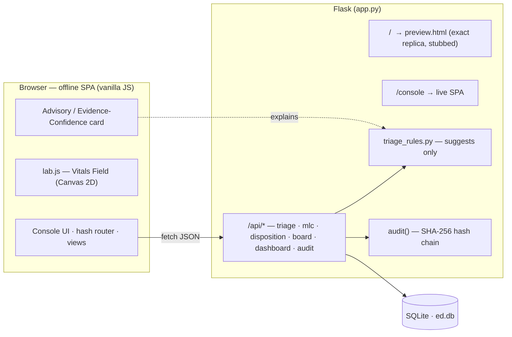

<div align="center">

# ED Triage Console — **The Living Ward**

### P5 · Emergency Department Triage & Medico‑Legal Workflow (PRD‑05)

A premium, **offline‑first**, accessible hospital command‑center for emergency triage and the
Indian medico‑legal (MLC) workflow — deterministic, explainable, auditable, and **advisory‑only**.
The engine *suggests*, the clinician *confirms*, and a tamper‑evident hash chain *remembers*.


</div>

---

## Table of contents

- [What this is](#what-this-is)
- [Screens](#screens)
- [Quick start](#quick-start)
- [Routes](#routes)
- [Tech stack (explained)](#tech-stack-explained)
- [Viewing the database](#viewing-the-database)
- [Architecture](#architecture)
- [Data model](#data-model)
- [Features](#features)
- [AI — advisory only](#ai--advisory-only)
- [Design system — “The Living Ward”](#design-system--the-living-ward)
- [Testing](#testing)
- [Project structure](#project-structure)
- [Compliance](#compliance)
- [Known gaps](#known-gaps)
- [License](#license)

---

## What this is

An emergency department must **treat first and reconcile identity later** (Art. 21 / *Parmanand
Katara v. Union of India*, SC 1989), assign clinical acuity in seconds, and — when a case is
medico‑legal — meet statutory police‑intimation duties (BNSS 2023 §194‑196, POCSO §19‑21) with a
**court‑defensible, tamper‑evident** record. The software must never delay care to protect its own
compliance record.

This repo delivers that as a working console: quick (treat‑first) registration → **≤60‑second
triage** with an advisory acuity suggestion → live tracking board → physician attend
(door‑to‑doctor) → MLC case + police intimation → disposition → a **hash‑chained audit trail** and
an override report.

> **Users:** triage nurse · physician · CMO · admin.  **Data:** 100% synthetic (DPDP).

---

## Screens

| | |
|---|---|
| **Dashboard** — command center, live KPIs, acuity mix, the animated *Vitals Field* | **Tracking board** — untriaged‑pinned, acuity colour spines, breach pulse, MLC serials |
| **≤60 s Triage** — live advisory suggestion + Evidence Confidence + 3D level picker | **Encounter hub** — patient, triage timeline, explainability, role‑gated actions |
| **MLC register + case** — gapless serials, POCSO notice, police‑intimation log | **Audit trail** — the *Evidence Spine*: live “chain verified / broken” verdict |

> _Add PNGs under `docs/screens/` and embed them here. Capture with `python app.py` → screenshot each route._

---

## Quick start

Requires **Python 3.11+**. One dependency (Flask); SQLite ships with Python.

```bash
# 1. install
python -m pip install -r requirements.txt

# 2. build the deterministic demo database (idempotent — safe to re-run)
python seed.py

# 3. run
python app.py            # → http://127.0.0.1:5000
```

Open **http://127.0.0.1:5000**. No login/password gate — pick a role from the sidebar identity
chip (Nurse / Physician / CMO / Admin); it sets the recorded actor and gates actions.

---

## Routes

The app ships **two front doors** from the same backend:

| URL | What it serves | Needs DB? |
|---|---|---|
| **`/`** | **The Living Ward** — the exact design replica (`preview.html`). Self‑contained: an inline deterministic API stub drives it with demo data, so it renders the full experience with **no backend**. | ❌ |
| **`/console`** | The **live, backend‑wired SPA** (`templates/index.html`) — hits the real Flask API + SQLite. | ✅ |
| `/api/*` | JSON API (triage, MLC, audit, dashboard KPIs, …) used by `/console`. | ✅ |

So `/` is the pixel‑exact design showcase; `/console` is the functional product.

---

## Tech stack (explained)

Deliberately **minimal and offline‑first** — a hard non‑functional requirement is *“the ED cannot
stop for IT”*: no CDN, no web‑font fetch, no external API calls, no build step.

| Layer | Choice | Why |
|---|---|---|
| **Language** | Python 3.11 | Batteries‑included; `sqlite3` in the stdlib means zero DB install. |
| **Web framework** | **Flask 3** (single `app.py`) | Tiny, explicit, easy to audit. It serves the JSON API **and** the HTML. It is the *only* runtime dependency (`requirements.txt`). |
| **Database** | **SQLite** (file: `ed.db`) | Single‑file, embedded, transactional, zero‑config — ideal for a single‑process ED console. Schema in `schema.sql`. |
| **Rules engine** | Pure‑Python `triage_rules.py` | Configurable AIIMS Triage Protocol — *suggests* an acuity level with reasons; **never assigns**. This is the explainable “AI”. |
| **Audit** | SHA‑256 **hash‑chained** `audit_log` + append‑only triggers | Tamper‑evident: editing any historical row breaks every hash after it. |
| **Frontend** | **Vanilla JS** SPA (`static/js/app.js`), hash router, no framework, **no build** | Offline NFR + auditability. Talks to `/api/*` with `fetch`. |
| **3D / motion** | Hand‑rolled **Canvas 2D** “Vitals Field” (`static/js/lab.js`) | The signature living‑ward background — no Three.js/WebGL dependency, respects `prefers-reduced-motion`. |
| **Charts** | Hand‑rolled **inline SVG** (donuts, bars) | No chart library → truly offline and dependency‑free. |
| **Styling** | CSS design system: `console.css` (structure) + `lab-theme.css` (the “Integrated Biosciences / Living Ward” skin) | System fonts only (offline). Tokens for colour, type, spacing, motion. |
| **Tests** | Python stdlib + Flask test client | `test_e2e.py` (M2 invariants) + `test_m3.py` (M3 flows/read models). |

**In one sentence:** *Flask + SQLite backend, a dependency‑free vanilla‑JS SPA frontend, and a
deterministic Python rules engine — everything runs offline with a single `pip install flask`.*

---

## Viewing the database

`ed.db` is a standard SQLite file in the project root. Pick whichever you like:

### 1. GUI (easiest) — DB Browser for SQLite
Free, cross‑platform. Install, then **File → Open Database → `ed.db`** → *Browse Data* tab.
```
https://sqlitebrowser.org
```

### 2. VS Code extension
Install **“SQLite Viewer”** (or *SQLite* by alexcvzz) → right‑click `ed.db` → *Open Database* →
tables show in the sidebar; click to view rows.

### 3. Command line — `sqlite3`
```bash
sqlite3 ed.db
sqlite> .tables                       -- list tables
sqlite> .schema ed_encounter          -- see a table's DDL
sqlite> SELECT id, status, is_mlc FROM ed_encounter;
sqlite> SELECT * FROM v_tracking_board;   -- the board read-model
sqlite> .quit
```

### 4. Python one‑liner (no install — you already have it)
```bash
python -c "import sqlite3; c=sqlite3.connect('ed.db'); \
print([r[0] for r in c.execute(\"SELECT name FROM sqlite_master WHERE type='table'\")])"
```
Row counts per table:
```bash
python -c "import sqlite3; c=sqlite3.connect('ed.db'); \
[print(t, c.execute(f'SELECT COUNT(*) FROM {t}').fetchone()[0]) \
for (t,) in c.execute(\"SELECT name FROM sqlite_master WHERE type='table' ORDER BY name\")]"
```

### 5. Inside the app (no SQL needed)
Run `/console` and open **ED Register** (all encounters) or **Audit Trail** (every hash‑chained
action, with the live chain‑verified badge).

> **Reset to a clean, deterministic state** any time: `python seed.py` (drops and rebuilds `ed.db`),
> or the sidebar role‑menu → **Reset demo data** (debug mode only).

---

## Architecture



More diagrams (ERD, workflow, AI‑advisory sequence) in [`docs/ARCHITECTURE.md`](docs/ARCHITECTURE.md).

---

## Data model

9 tables + 2 read‑model views. Highlights: nearly every `patient` column is **nullable by design**
(treat‑first), triage stores **both** the suggested and the confirmed level, MLC serials are
**gapless**, and `audit_log` is append‑only and hash‑chained.

```
patient · ed_encounter · triage_event · vital signs (inline) · mlc_case · mlc_counter
police_intimation · disposition · audit_log · triage_scale_config
views: v_tracking_board · v_override_report
```

Full DDL in [`schema.sql`](schema.sql); ERD in [`docs/ARCHITECTURE.md`](docs/ARCHITECTURE.md).

---

## Features

- **Operations dashboard** — 6 data‑derived KPIs (active, NABH breaches, door‑to‑doctor median, active MLC, in‑treatment, overrides), acuity‑mix bars, disposition donut, rule‑based insight.
- **ED tracking board** — untriaged‑pinned, acuity colour spines, live wait, breach pulse, MLC coral chips, 30 s auto‑refresh.
- **≤60 s triage** — two‑column, keyboard‑first, live advisory suggestion + reasons + Evidence Confidence, 3D level picker, mandatory override reason.
- **Quick registration** — one‑click unknown/unconscious (treat‑first) + identified form.
- **MLC register + case detail** — gapless serials, POCSO notice, police‑intimation log.
- **Disposition** — type‑driven; the **US‑6** warning (MLC + no intimation → *warn, never block*).
- **Audit trail** viewer with live hash‑chain verdict; **override report** (monthly, PRD‑05 §11).
- Command palette (**Ctrl/⌘‑K**), role switcher, demo reset, responsive, WCAG‑AA, reduced‑motion.

---

## AI — advisory only

No engine output ever mutates a clinical or statutory record. The engine **suggests**; a human
**confirms**; the confirmation (and any override reason) is written to the tamper‑evident chain,
and the suggestion is **recomputed server‑side** on submit (so the guarantee can’t depend on client
JS). Each advisory card shows: recommendation · **Evidence Confidence** (High/Med/Low + *why*) ·
evidence list · human Accept/Override. Details in [`docs/AI_ADVISORY.md`](docs/AI_ADVISORY.md); the
Hybrid‑RAG roadmap (architected, not faked) is in [`docs/KNOWN_GAPS.md`](docs/KNOWN_GAPS.md).

---

## Design system — “The Living Ward”

A dark bioluminescent‑laboratory skin: Abyssal‑Ink canvas, flat surfaces, hairline borders,
single‑weight editorial display type + monospace technical labels, one rationed lime accent, and
the five fixed acuity colours (L1 red → L5 blue) used as **functional data, never decoration**.
The signature background is the **Vitals Field** (`lab.js`) — a living cell‑field where acuity =
luminescence and MLC cells carry a warm halo. See [`docs/DESIGN_SKIN.md`](docs/DESIGN_SKIN.md).

---

## Testing

```bash
python test_e2e.py       # M2 invariants — 25 checks
python test_m3.py        # M3 flows / read models — 26 checks
```

Covers: treat‑first registration, advisory suggestion + override enforcement, gapless MLC serials,
US‑6 warn‑not‑block, hash‑chain tamper detection, door‑to‑doctor, KPI computation, and demo‑reset
guarding. **51 checks, all passing.**

---

## Project structure

```
app.py                 Flask: JSON API + / (replica) + /console (live) + read/KPI endpoints
triage_rules.py        AIIMS Triage Protocol engine (advisory)
schema.sql             SQLite DDL (9 tables, 2 views, audit triggers)
seed.py                deterministic demo data + hash-chained audit rows
preview.html           THE LIVING WARD — self-contained exact replica (served at /)
templates/index.html   live SPA shell (served at /console)
static/css/console.css design system (structure, tokens, components)
static/css/lab-theme.css  "Integrated Biosciences" skin
static/js/app.js       SPA — router + every screen, wired to /api/*
static/js/lab.js        Vitals Field (Canvas 2D signature background)
static/favicon.svg
test_e2e.py            M2 compliance suite (25)
test_m3.py             M3 flows/read-model suite (26)
docs/                  audit, architecture, completion, verification, gaps, design-skin, demo
```

---

## Compliance

Art. 21 treat‑first · BNSS 2023 §194‑196 (police intimation) · POCSO §19‑21 (mandatory reporting) ·
NABH time‑norms · MCCD Form 4/4A · DPDP (synthetic data only). External systems (ABDM/ABHA/PMJAY/
police portals) would be **mock/stub only**. See [`docs/COMPLIANCE.md`](docs/COMPLIANCE.md).

---

## Known gaps

Server‑side auth/RBAC, patient‑reconciliation UI, and a local Hybrid‑RAG/LLM copilot are
**documented, not faked** — see [`docs/KNOWN_GAPS.md`](docs/KNOWN_GAPS.md).

---

## License

MIT — see `LICENSE`. All patient data in this repo is **synthetic**; no real personal data is used.

<div align="center"><sub>Built as P5 · PRD‑05 · M2 design‑freeze → M3 all‑flows‑end‑to‑end.</sub></div>
