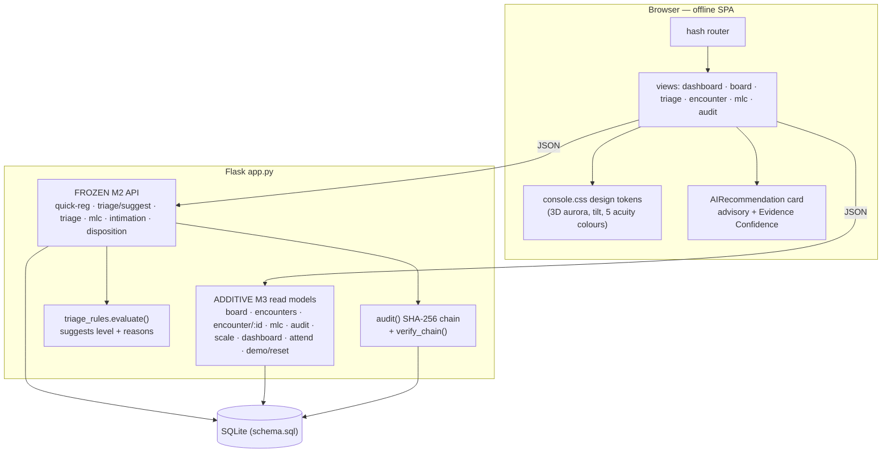
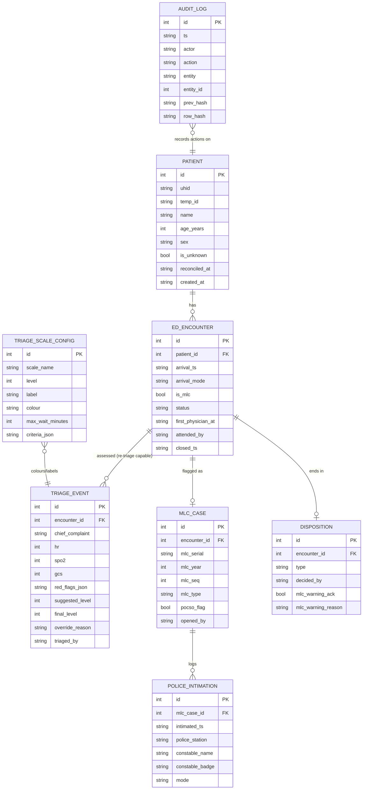
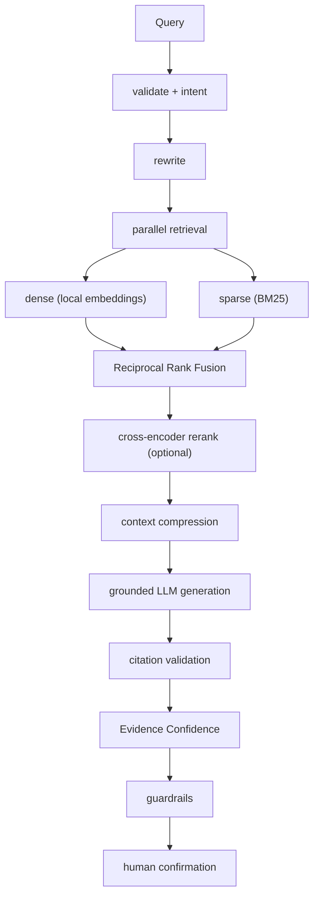
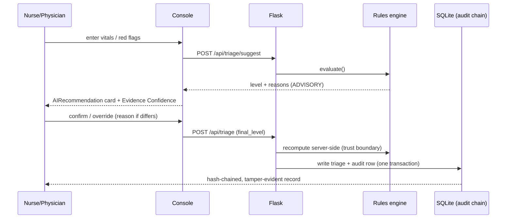

# Architecture — ED Triage Console (P5)

## 1. System architecture

## 2. Database ERD

## 3. Core M3 workflow (arrival → disposition)

```mermaid
flowchart LR
  A["Quick registration\n(treat-first, temp ID)"] --> T["Triage\nengine SUGGESTS · nurse CONFIRMS"]
  T -->|status TRIAGED| BRD["Tracking board\n(acuity spine, breach)"]
  BRD --> AT["Physician attends\n(door-to-doctor stamp)"]
  AT --> MLC{"Medico-legal?"}
  MLC -->|yes| OM["Open MLC (gapless serial)"] --> INT["Log police intimation\n(BNSS §194-196)"]
  MLC -->|no| D
  INT --> D["Disposition"]
  D -->|MLC & no intimation| W["US-6 WARN (409)\nnever blocks — Art. 21"]
  W -->|ack + justification ≥10 chars| D2["Disposition saved"]
  D --> D2
  D2 -->|status CLOSED| END(["Encounter closed"])
```

## 4. Hybrid RAG pipeline (architected — see KNOWN_GAPS)

_This pipeline is documented as the roadmap; the shipped console uses the deterministic,
already-explainable triage engine for its advisory cards rather than a fabricated LLM._

## 5. AI advisory workflow (what ships)

